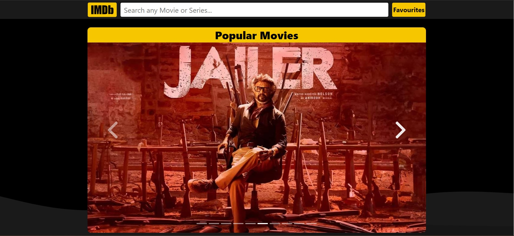
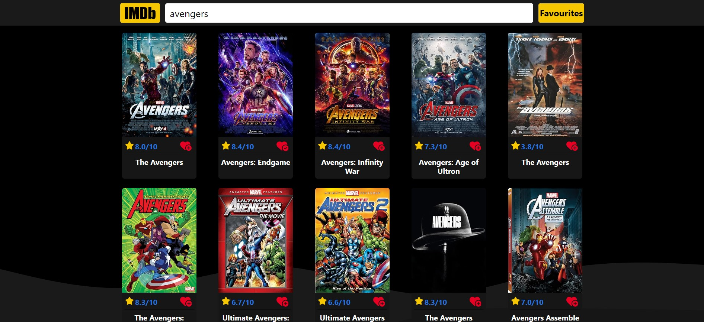
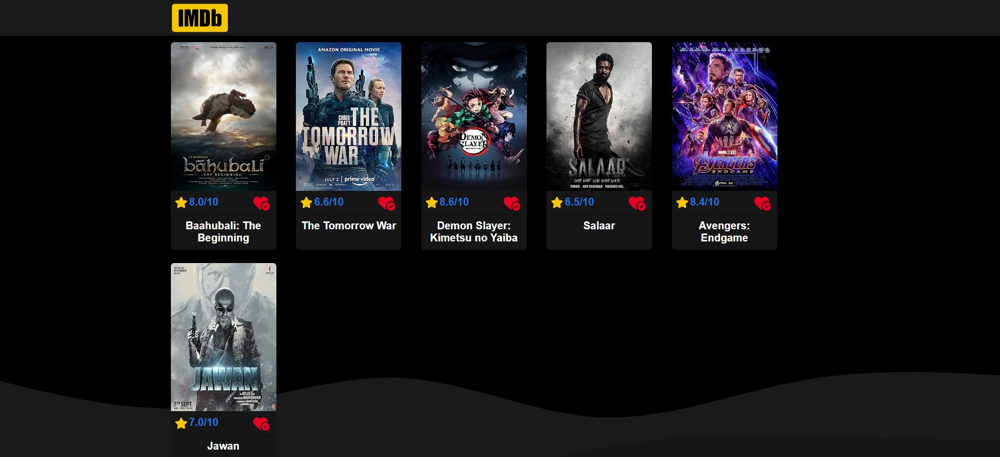
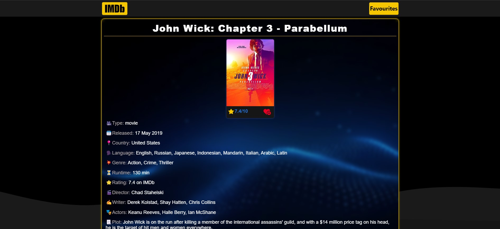

# IMDb Clone Project

This project is a simplified clone of the IMDb website, focusing on the core features that allow users to search for movies or series, manage a favourites list, view movie ratings, and directly access official IMDb pages for more detailed information. It includes three main pages: Home, Favourites, and Movie Details, each offering specific functionalities to enhance the user experience.

## Live Demo

You can explore a live version of the IMDb Clone here: [Visit Live Website](https://guru-bandike.github.io/IMDB-clone/)

## Features

### Home Page

- **Search Functionality**: Users can search for movies or series using the search bar.
- **Favourites Management**: Users can add or remove items from their favourites list.
- **Movie Ratings**: Display ratings for each movie or series.
- **Direct IMDb Access**: Clicking on a movie's rating opens a new tab with the movie's details on the official IMDb website.
- **Popular Movies Carousel**: A carousel showcasing popular movies for quick access.

### Favourites Page

- **Persistent Favourites List**: Users can add or remove items from their favourites list. The list remains intact across browser sessions, reloads, or tab closures.
- **View All Favourite Movies**: Users can see a list of all their favourite movies, making it easy to revisit their top choices.

### Movie Details Page

- **Detailed Movie Information**: Provides comprehensive details about the selected movie, including plot, cast, and more.
- **Favourites Management**: Allows users to add or remove the movie from their favourites list directly from this page.

## Compatibility

Designed to be compatible with older browsers, this project avoids using modern JavaScript modules, which are not supported by some older browsers. Instead, it relies on a shared set of Vanilla JavaScript and CSS files to ensure broad accessibility.

## Getting Started

To explore this project, clone it from GitHub and open `index.html` in a web browser:

1. Clone the repository: `git clone https://github.com/guru-bandike/IMDB-clone.git`
2. Navigate to the project directory: `cd imdb-clone`
3. Open `index.html` in your browser.
